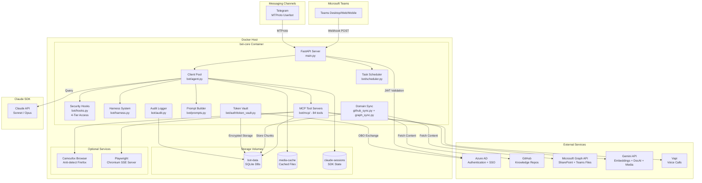
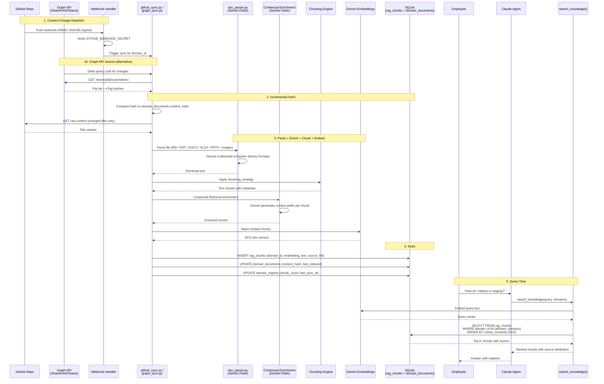
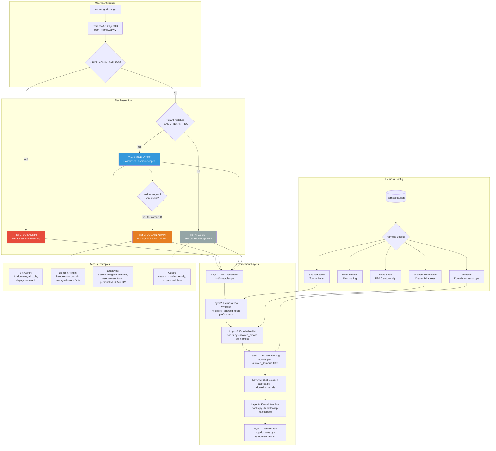
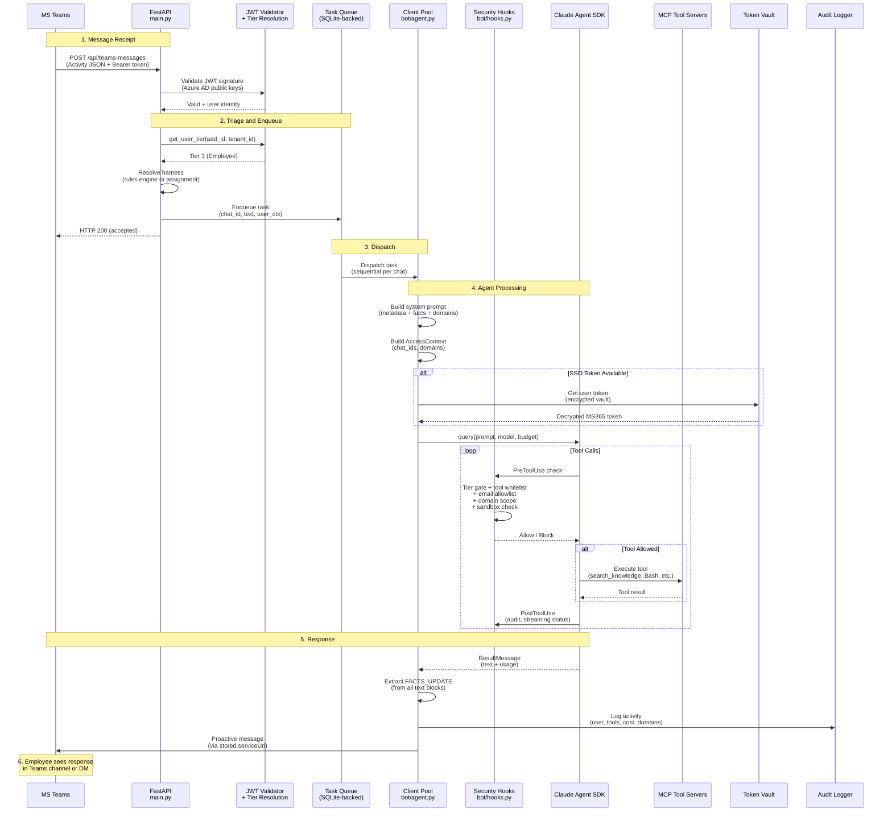

# Architecture Diagrams

Visual reference for the Corporate Bot platform architecture. All diagrams use [Mermaid](https://mermaid.js.org/) syntax.

---

## 1. System Architecture

High-level view of containers, external services, and data flow.

---

## 2. Knowledge Domain Data Flow

How documentation flows from source repositories (GitHub or Microsoft Graph API) through the indexing pipeline to search results. Gemini Flash handles document parsing (PDF, DOCX, XLSX, PPTX, images) and contextual chunk enrichment.

---

## 3. Permission Model

Four-tier access control from Bot Admin down to Guest, showing how permissions flow through harnesses and enforcement layers.

---

## 4. Message Pipeline

End-to-end flow from an incoming Teams message through agent processing to the response.

---

## Additional References

- [CORPORATE_ARCHITECTURE.md](CORPORATE_ARCHITECTURE.md) -- Module-level architecture details
- [KNOWLEDGE_DOMAINS_ARCHITECTURE.md](KNOWLEDGE_DOMAINS_ARCHITECTURE.md) -- 9-layer domain stack
- [ACCESS_MANAGEMENT.md](ACCESS_MANAGEMENT.md) -- Detailed permission model and credential tiers
- [ARCHITECTURE.md](ARCHITECTURE.md) -- Full component reference and tuning parameters
